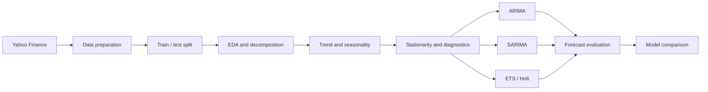

<div align="center">


<br>

# Bitcoin Price Forecasting Using Time Series Analysis

**An end-to-end statistical forecasting project built in R**

[](https://www.r-project.org/)
[](https://rmarkdown.rstudio.com/)
[](#project-workflow)
[](#forecasting-models)
[](#)

[Overview](#overview) · [Workflow](#project-workflow) · [Models](#forecasting-models) · [Results](#key-results) · [Run locally](#run-locally)

</div>

---

## Overview

This project analyzes and forecasts daily **Bitcoin closing prices from 2022 to 2026**. It follows a complete time-series workflow: data acquisition, exploratory analysis, decomposition, trend and seasonality assessment, stationarity testing, residual diagnostics, model training, out-of-sample evaluation, and visual comparison.

The data is downloaded directly from Yahoo Finance using `quantmod`, then divided into an **80% training set** and a **20% testing set**. Forecasting performance is evaluated with **RMSE, MAE, and MAPE**.

<table>
<tr>
<td width="33%" align="center"><strong>Data</strong><br>BTC-USD daily closing prices</td>
<td width="33%" align="center"><strong>Period</strong><br>2022–2026</td>
<td width="33%" align="center"><strong>Best model</strong><br>SARIMA(1,1,1)(1,0,1)[7]</td>
</tr>
</table>

## Project Workflow



### 1. Decomposition and structure

The series is decomposed using both classical multiplicative decomposition and STL. The analysis identifies a strong long-term trend, comparatively weak seasonal behavior, and periods of substantial residual volatility.

<p align="center">
  
</p>

### 2. Trend analysis

Linear and quadratic models are fitted to log-transformed prices. The quadratic specification explains substantially more variability than the linear model and better reflects the changing direction of the market.

<p align="center">
  
</p>

### 3. Seasonality and residual diagnostics

The project investigates weekday effects, trigonometric seasonality, autocorrelation, and the residual spectrum. These diagnostics help determine whether recurring patterns remain after trend removal.

<table>
<tr>
<td width="50%"></td>
<td width="50%"></td>
</tr>
</table>

## Forecasting Models

| Model | Role in the analysis |
|---|---|
| **ARIMA** | Non-seasonal benchmark models and automatic order selection |
| **SARIMA(1,1,1)(1,0,1)[7]** | ARIMA with a weekly seasonal component |
| **ETS(M,Ad,N)** | Multiplicative-error, damped-trend exponential smoothing |
| **Holt** | Trend-based exponential smoothing without seasonality |

The models are trained only on the training sample and evaluated against the unseen testing period.

## Key Results

| Model | RMSE (USD) | MAE (USD) | MAPE | Assessment |
|---|---:|---:|---:|---|
| **SARIMA** | **33,317.08** | **27,884.93** | **35.58%** | Best test-set accuracy |
| **ETS** | 33,385.23 | 27,953.14 | 35.66% | Nearly equivalent and stable |
| **Holt** | 70,543.41 | — | 76.09% | Overestimated the continuing trend |
| **ARIMA** | 280,820.90 | — | 303.20% | Least suitable for this period |

> **Conclusion:** SARIMA achieved the lowest forecasting errors. ETS produced almost identical accuracy and remains a strong, interpretable alternative. The classical ARIMA forecast was unstable and generated very wide prediction intervals.

<p align="center">
  
</p>

### Forecast examples

<table>
<tr>
<td align="center"><strong>SARIMA</strong></td>
<td align="center"><strong>ETS</strong></td>
</tr>
<tr>
<td></td>
<td></td>
</tr>
</table>

## Technology Stack

| Area | Tools |
|---|---|
| Language | R |
| Data acquisition | `quantmod` |
| Forecasting | `forecast`, `tseries` |
| Data wrangling | `dplyr`, `lubridate` |
| Visualization | `ggplot2`, `gridExtra` |
| Reporting | R Markdown, `knitr` |

## Repository Structure

```text
.
├── README.md
├── Project.Rmd
├── Project.html
├── assets/
│   ├── project-banner.png
│   ├── stl-decomposition.png
│   ├── trend-comparison.png
│   ├── weekday-effect.png
│   ├── residual-acf.png
│   ├── arima-forecast.png
│   ├── sarima-test-forecast.png
│   ├── ets-forecast.png
│   └── model-comparison.png
└── docs/
    └── index.html
```

## Run Locally

### Prerequisites

Install R and RStudio, then install the required packages:

```r
install.packages(c(
  "quantmod",
  "forecast",
  "tseries",
  "ggplot2",
  "dplyr",
  "gridExtra",
  "knitr",
  "lubridate"
))
```

### Generate the report

```r
rmarkdown::render("Project.Rmd")
```

The script downloads market data from Yahoo Finance, so an internet connection is required during execution.

## GitHub Pages

A website version is included in `docs/index.html`.

To publish it:

1. Open the repository **Settings**.
2. Select **Pages**.
3. Choose **Deploy from a branch**.
4. Select the `main` branch and the `/docs` folder.
5. Save the configuration.

## Limitations

Bitcoin prices are highly volatile and affected by events not represented in historical price data. The results describe this particular observation period and should not be interpreted as financial advice.

## Future Improvements

- Add rolling-origin cross-validation.
- Compare models with Prophet, XGBoost, and LSTM.
- Introduce external predictors such as trading volume and macroeconomic indicators.
- Build an interactive Shiny dashboard.
- Automate daily model retraining and forecast publication.

---

<div align="center">

### Author

**Ivan Bilyk**  
Computer and Mathematical Modelling  
Slovak University of Technology in Bratislava

<br>

<sub>Created for educational and portfolio purposes. This project does not provide investment advice.</sub>

</div>
